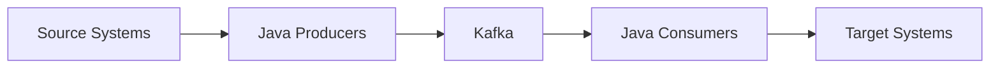
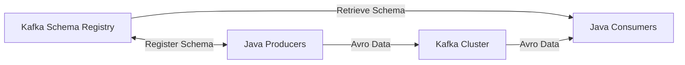
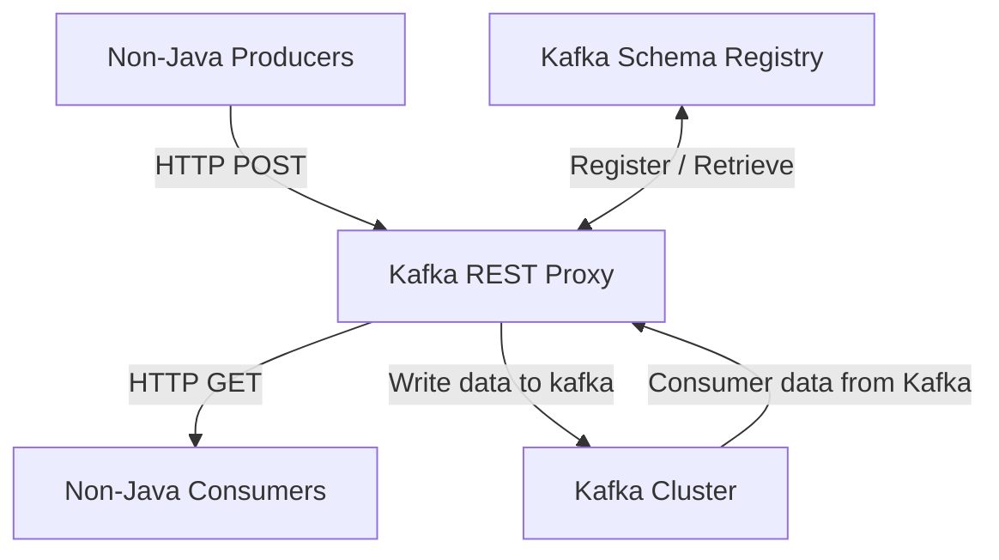

# Confluent Schema Registry and REST Proxy

### Use case

Kafka producers just send bytes. No data verification is performed. These bytes are just consumed.
What if the data is bad?
What if a field changes?
What if a data format changes?

The consumers will break.
If this happens then all real time capbilty will break down.
---> This can lead to real issues for companies.

We need data to be self describable.
We need to be able to evolve data withouth breaking dowstream consumers

### Soluution
Use schemas and a schema registry

### Why this way?
We can't verify the messages the kafka brokers recieve because it would break the strong points of kafka
- Kafka doesn't parse or even read your data (no CPU usage)
- Kafka takes bytes as an input without even loading them into memory (*zero copy*)
- Kafka distributes bytes
- As far as kafka is concerned, it doensn't even know if you data is an integer, string etc.

### The need for a schema registry
- The Schema Registry has to be a separate component
- Producers and Consumers need to be able to talk to it
- The Scheme Registry must be able to reject bad data
- A common data format must be agreed upon
- --- It needs to support schemas
- --- It needs to support evolution
- --- It needs to be lightweight
Solution -> the Confluent Schema Registry
And Apache Avro as the data format

### Kafka Ecosystem Kafka Core

### Kafka Ecosystem: Confluent Scheme Registry
TODO fix layout

### Kafka Ecosystem: Confluent REST Proxy

