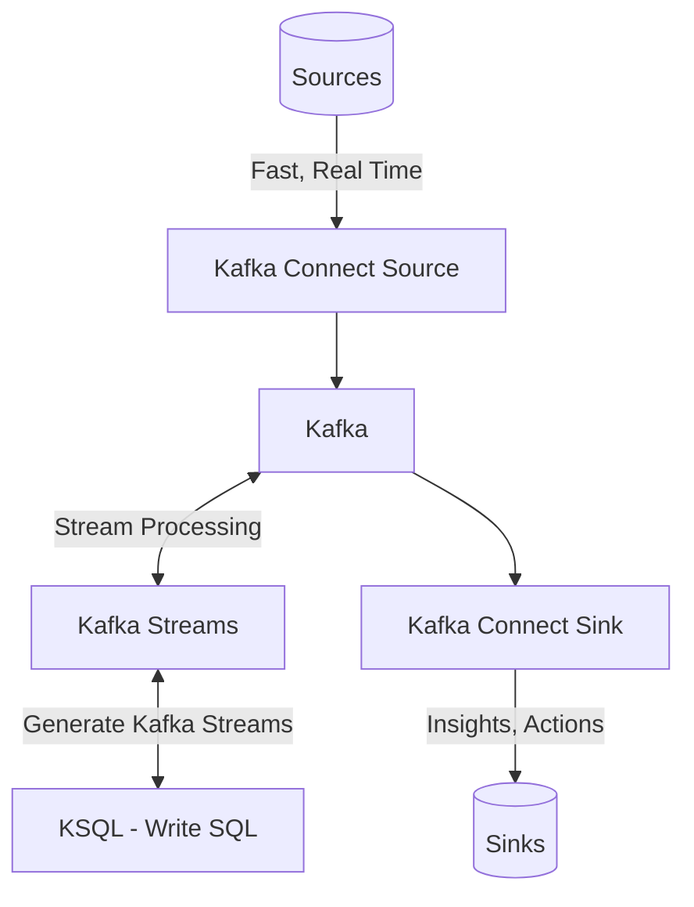
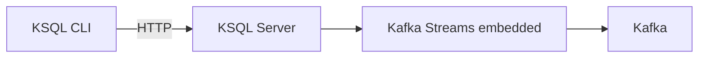

# KSQL and stream processing

# Data processing Pipelines in Kafka

## KSQL form Confluent
- Writing Kafka stream java applications is complex
  - May want to write SQL
  - Underneath, Kafka streams applications are generated
  - Get the same benefits (Scale, Security)

## KSQL use cases
- Real time analytics dashboard.
- Correlate event behaviour.
- Home automation notifications.
- .....

## How does KSQL work?
