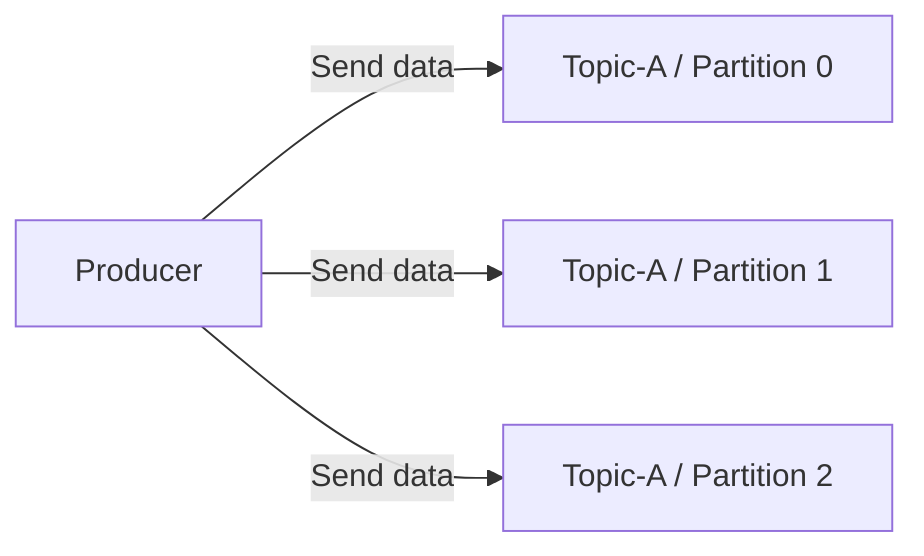
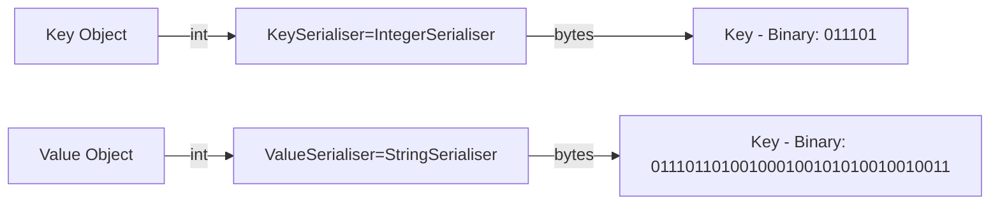
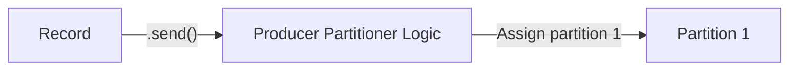
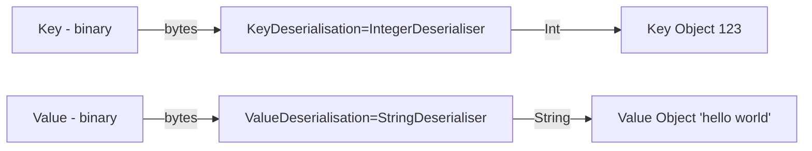
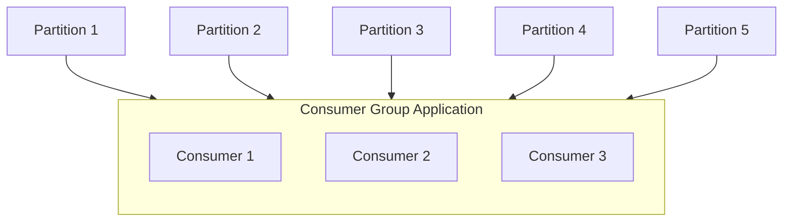
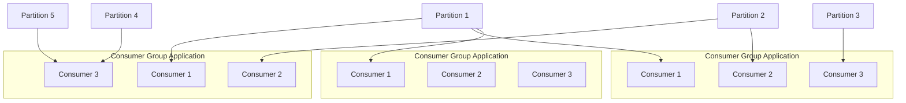
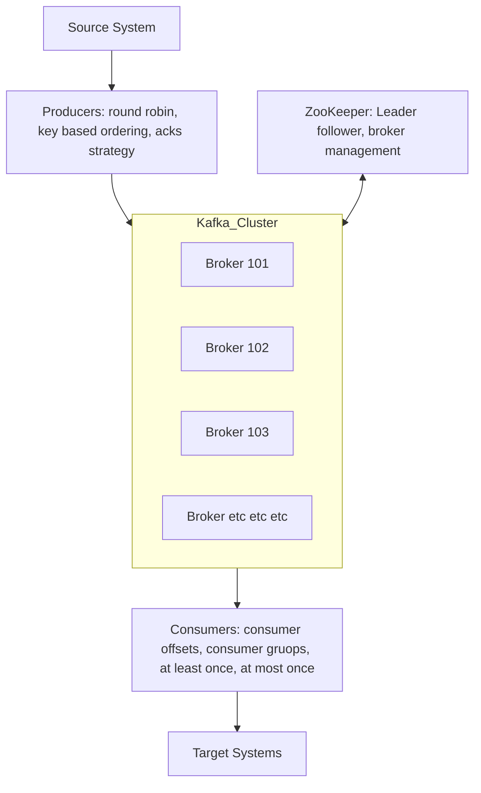

# Kafka introduction

- Useful for data integration

## Setting the stage

- Companies have a source system like a DB and at some point another part of the company will want to take that data to
  put it into another system.
- The data has to move from source system to a target system
- Initially very simple, someone writes some code and then takes the data, extracts it, transforms it and then loads it.
- Eventually system involves many source systems.
- --- Data integration challenges just got a lot more complicated, because all your target systems to share information.
- --- Example: 4 sources systems and 6 target systems you would have to write (4 x 6 = 24) data integration systems.
- ----> Additionally each integration comes with difficulty with around the protocol, because the technology has
  changed.
- -----> Data could be transported over TCP, HTTP, REST, FTP, JDBC
- -----> Data format - how the data is parsed (Binary, CSV, JSON, Avro, Protobuf)
- -----> Data schema and evolution - how the data is shaped and may change
- Each source system will have an increased load from the connections and the reqeusts to extract the data.

## Solution

- Decoupling using Apache Kafka
- Now the source systems responsible for sending data.
- --- Its called producing for producing data for Apache Kafka
- -----> So now Apache Kafka is going to have a data stream of all your data, of all your source systems within it and
  your target systems if they ever need to receive data from your systems they will actually tap into the data of Apache
  Kafka.
- -------> Because Kafka is meant to actually receive data from your systems, they will actually tap into the data of
  Apache Kafka, because Kafka is mean to receive and send data.
- -------> So you target systems are now consuming from Apache Kafka and everything is more *manageable/maintainable*
  and more *scalable*

What can source systems be for example?????

- They can be website events, pricing data, financial transaction or user interactions.
- All these things create data streams.
- That means data created in real time, and it is sent to apache kafka.

What can target systems be?

- Databases, analytics streams, email systems and audit systems.

This will lead to an architecture

## Why kafka

Kafka was created by LinkedIn.
Was created as an open source project but is now maintained by Confluent, IBM, Cloudera, LinkedIn.......more?
It's distributed, has a resilient architecture and is fault-tolerant
That means you can upgrade kafka and can do kafka maintenance without taking the whole system down.
Kafka is good for horizontal scalability, this means you can add brokers over time into your kafka cluster, and you can
scale to hundreds of brokers.
-- Kafka has huge scale for message throughput, so you have millions of messages per second. (Think twitter)
-- Its also high performance, so you have really low latency, sometimes it's measured in less than 10 milliseconds.
-----> This is why we call Apache Kafka a real time system (double check this).
-----> Kafka also has really wide adoption across the world/industries

2,000 firms using Kafka publicly, 80% of the fortune 100 are using Apache Kafka.
---> Big names are using it. Don't necessarily have to be a big corporation to use it.

## Use cases, how is Apache Kafka used

- Used as a messaging system
- Activity tacking system.
- Gather metrics from many different locations
- Application Logs gathering
- Stream processing (with the Kafka Streams API for example)
- It's used to decouple system dependencies and microservices
- It has integration with big data technologies such as Spark, Flink, Storm Hadoop.
- Micro-services pub/sub

## Use cases

- Netflix uses Kafka to apply recommendations in real-time while you're watching TV shows
- Uber uses Kafka to gather user, taxi and trip data in real-time to compute and forcast demand and compute surge
  pricing in real-time
- LinkedIn uses Kafka to prevent spam, collect user interactions to make better connection recommendations in real time.

*kafka is only used as a transportation mechanism*

---

# Additional Areas

- Kafka Connect
- Kafka Streams
- ksqlDB
- Confluent Components
- Kafka Security
- Kafka Monitoring and Operations
- Kafka Cluster Setup

---

### Kafka Topics

- Topics: a particular stream of data
- Like a table in a database (without all the constraints)
- You can have as many topics as you want
- A topic is identified by it name
- Any kind of message format
- The sequence of messages is called a data stream
- You cannot query topics, instead, use Kafka Producers to send data to a topic
    - and Kafka Consumers to read the data form the topic

### Partitions and offsets

- Topics are split into partitions
- -- Message within each partition are ordered
- -- Each message within a partition gets an incremental id, called an offset
- Kafka topics are immutable: once data is written to a partition, it cannot be changed.

### Topics, partitions and offsets - important notes

- Once the data is written to a partition, it cannot be changed (immutability)
- Data is kept only for a limited time (default is one week - configurable)
- Offsets only have meaning for specific partition
    - Offset in partition 0 doesn't represent the same data as offset 3 in partition 1
    - Offsets are not re-used even if previous message have been deleted
- Order is guaranteed only within a partition (not across partitions)

### Producers

- Producers write data to topics (which are made of partitions)
- Producers know to which partition to write to (and which Kafka broker has it)
- In case of Kafka broker failures, Producers will automatically recover

*Load is balanced by the the number of brokers due to the partitioning system*



### Producers: Message Keys

- Producers can choose to send a key with the message (string, number, binary, etc.)
- If ```key=null```, data is sent round-robin (partition 0, then 1, then 2.....)
- If ```key!=null```, then all messages for that key will always go to the same partition (hashing)
- A key is typically sent if you need message ordering for specific field

# Kafka Messages anatomy (chatGPT generated / needs checking)

| **Field**       | **Description**                                                                                                     | **Example**                       |
|-----------------|---------------------------------------------------------------------------------------------------------------------|-----------------------------------|
| **Key**         | An optional field used for partitioning. Kafka uses the key to determine the partition where the message is stored. | `user_id_123`                     |
| **Value**       | The actual content or payload of the message. Can be in **JSON, Avro, Protobuf**, or plain text format.             | `{"name": "Alice", "age": 30}`    |
| **Timestamp**   | The time at which the message was produced. Can be set by the producer or Kafka itself.                             | `2025-03-25T10:15:30Z`            |
| **Partition**   | The Kafka partition where the message is sent. Determined by the key or round-robin distribution.                   | `Partition 1`                     |
| **Offset**      | The unique ID assigned to the message in the partition. Ensures **ordering and retrieval**.                         | `42`                              |
| **Headers**     | Key-value pairs containing metadata about the message.                                                              | `{"source": "api", "env": "dev"}` |
| **Topic**       | The destination topic where the message is published.                                                               | `user_events`                     |
| **Producer ID** | The ID of the producer sending the message. Helps identify the producer in Kafka logs.                              | `producer-1`                      |
| **Compression** | Optional compression codec used (e.g., `gzip`, `snappy`, `lz4`, `zstd`) to reduce message size.                     | `gzip`                            |


Kafka Message Serializer
- Kafka only accepts bytes as an input from producers and sends bytes out as an output to consumers
- Message Serialisation means transforming objects / data into bytes
- They are used on the value and the key
- Common Serialisers
  - String (incl. JSON)
  - Int, Float
  - Avro
  - Protobuf


### Kafka Message Key Hashing
- A Kafka partitioner is code logic that takes a record and determines which partition to send it into

- **Key Hashing** is the process of determining the mapping of a key to a partition
- In the default Kafka partitioner, the keys are hashed using the **murmur2 algorithm** with the formula below
```targetPartition = Math.abs(Utils.murmur2(keyBytes)) % (numPartitions - 1)```

### Consumers
- Consumers read data from a topic (identified by name) - pull model
- Consumers automatically know which broker to read from
- In case of broker failures, consumers know how to recover
- **Data is read in order from low to high offset *within each partition* **

### Consumer Deserializer
- Deserilaise indicated how to transform into objects / data
- They are used on the value and the key of the message
- Common deserialisers
  - String (incl. JSON)
  - String (Int, Float)
  - String (Avro)
  - String (Protobuf)
- The serialisation / deserialization type must not change during a topic lifecycle (create a new topic instead)


### Consumer Groups
- All the consumers in an application read data as consumer groups
- Each consumer within a group reads from an exclusive partition
TODO check this diagram


### Consumer Groups - What if too many consumers?
- If you have more consumers than partitions, some consumers will be inactive
//Diagram

### Multilpe Consumers on one topic
- In Apache Kafka it is acceptable to have multiple consumer groups on the same topic
- To create distinct consumer groups, use the consumer property `group.id`
 
TODO double check this diagram


### Consumer Offsets
- Kafka stores the offsets at which a consumer group has been reading
- The offsets committed are in Kafka topic named `__consumer_offsets`
- When a consumer in a group has processed data received from Kafka, it should be periodically commiting the offsets
  - (the Kafka broker will write to __consumer_offsets, not the group itself)
- If a consumer dies, it will be able to read back from where it left off thanks to the committed consumer offsets

### Delivery semantics for consumers
- By default, Java Consumers will automatically commit offsets (at least once)
- There are 3 delivery semantics if you choose to commit manually
- At lead once (usually preferred)
  - Offsets are committed after the message is processed
  - If the processing goes wrong, the message will be read again
  - This can result in duplicate processing of messages. Make sure the processing is *idempotent* (running the same action again won't change the result)
- At most once
  - Offsets are committed as soon as message are received
  - If the processing goes wrong, some messages will be lost (they won't read again)
- Exactly once
  - For Kafka => Kafka Workflows: use the TransactionalAPI (easy with Kafka Streams API)
  - For Kafka => External System Workflows: use an idempotent consumers

# Brokers and Topics

## Kafka Brokers

- A kafka cluster is composed of multiple brokers (servers)
- Each broker is identified with its ID (integer)
- Each broker contains certain topic partitions
- After connecting to any broker (called a bootstrap broker), you will be connected to the entire cluster (Kafka clients have *smart* mechanics for that)

*A good number to get start is 3 brokers, but in real world big clusters have over 100 brokers*
 
TODO insert example here

## Kafka Broker Discovery
- Every Kafka broker is also called a "bootstrap server"
- That means that you only need to connect to on broker and the Kafka clients will know how to be connected to the entire cluster (smart clients)
- Each broker knows about all brokers, topics and partitions (metadata)


TODO insert diagram

### Topics replication

## Topics replication factor
- Topics should have a replication factor > 1 (usually between 2 and 3)
- This way if a broker is down, another broker can serve the data
TODO insert diagram if I really need it...........

## Concept of Leader for a Partition
- At any time only ONE broker can be a leader for a given partition
- Producers can only send data to the broker that is leader of a partition
- The other brokers will replicate the data
- Therefore, each partition has one leader and multiple ISR (in-sync-replica)
TODO insert diagram if I really need it...........

Default producer and consumer behaviour with leaders
- Kafka Producers can only write to the leader broker for a partition
- Kafka Consumers by default will read from the leader broker for a partition

## Kafka Consumers Replica Fetching (Kafka v2.4+)
- Since Kafka 2.4,  it is possible to configure consumers to read from the closest replica
- This may help improve latency and also decrease network costs if using the cloud (*graph optimsation 🤔*)
DIAGRAM maybe

# Producer Acknowledgements and Topic Durability

## Producer Acknowledgements (acks)
- Producers can choose to receive acknowledgement of data writes:
  - `acks=0` : Producer won't wait for acknowledgement (possible data loss)
  - `acks=1` : Producer will wait for leader acknowledgement (limited data loss)
  - `acks=all` : Leader + replicas acknowledgement (no data loss)

## Kafka Topic Durability
- For topic replication factor of 3, topic data durability can withstand the loss of two brokers
- As a rule, for a replication factor of N, you can permanently lose up to N-1 brokers and still recover your data 🤷‍♂️

# Zookeeper
- Zookeeper manages brokers (keeps a list of them)
- Zookeeper helps in performing leader elections for partitions
- Zookeeper sends notifications to Kafka in case of changes (examples: new topic, broker dies, broker comes up, delete topics, etc......)
- *Kafka 2.x can't work without Zookeeper*
- *Kafka 3.x can work without Zookeeper - using Kraft Raft instead*
- *Kafka 4.x will not have Zookeeper*
- Zookeeper by design operates with an odd number of servers (1, 3, 5, 7)
- Zookeeper has a leader (writes) the rest of the servers are followers (reads)
- (Zookeeper does NOT store consumer offsets with Kafka > v0.10)

## Zookeerper Cluster (ensemble)
TODO insert diagram here

## Should I use Zookeeper (important)
- With kafka brokers?
  - Yes, until v4.0 is production ready (no yet )
- With Kafka Clients?
  - Over time, the Kafka clients and CLI have been migrated to leverage the brokers as a connection endpoint instead of zookeeper
  - Since Kafka 0.10 consumers store offset in Kafka and Zookeeper and must not connect to Zookeeper as it is depricated ??????
  - Since kafka 2.2 the `kafka_topics.sh` CLI command references Kafka brokers and not Zookeeper for topic management (creation, deletion, etc....) and the Zookeeper CLI argument is deprecated
  - All the APIs and commands that were previously leveraging Zookeeper are migrated to use kafka instead, so that when clusters are migrated to be withouth Zookeeper, the change is invisible to clients
  - **Wise idea to not use ZooKeeper for configuring kafka clients and any other programs that connect to kafka**

# About Kafka Kraft
- In 2020 KIP-500 began to remove the ZooKeeper dependency from Kafka
- Zookeeper shows scaling issues when Kafka clusters have > 100,000 partitions.
- By removing Zookeeper, Apache Kafka can
  - Scale to millions or partitions and becomes easier to maintain and set-up
  - Improve stability by making it easier to monitor, support and administer
  - Single security model for the whole system
  - Single process to start with Kafka
  - Faster controller shutdown and recovery time
- Kafka 3.X now implements the Raft protocol (KRaft) in order to replace ZooKeeper

# Summary Graph of Kafka Concepts


---
# Advanced Topics for Kafka

## Changing a Topic Configuration

### Why should I care?
- Brokers have defaults for all the topic configurations parameters
- These parameters impact performance and topic behaviour
- Some topics may need different values that the defaults
  - Replication Factor
  - \# of Partitions
  - Message siz
  - Compression level
  - Log Cleanup Policy
  - Min Insync Replicas
  - Other configurations

SEE KAFKA documentation can be found at: https://kafka.apache.org/documentation/#brokerconfigs

## Segment and Indexes

### Partitions and Segments
- Topics are made of partitions....
- Partitions are made of ... segments (which are just files)

TODO insert diagram here

- Only *segment* is active (the one, that is being written to)
- Two segment settings:
  - `log.segment.bytes:` the max size of a single segment in bytes (default 1GB)
  - `log.segment.ms:` the time Kafka will wait before committing the segment if not full (1 week)

### Segments and Indexes
- Segments come with two indexes (files):
  - An offset to position index: helps Kafka find where to read from to find a message
  - A timestamp to offset index: helps Kafka find messages with a specific timestamp

TODO insert a diagram

### Segments: Why should I care?
- A smaller `log.segments.bytes` (size, default: 1GB) means:
  - More segments per partitions
  - Log Compaction happens more often
  - BUT Kafka must keep more file opened (*Error: Too many open files*)
- *Consider* How fast will have new segments based on throughput?

- A smaller log.segment.ms (time, default 1 week) means:
  - You set a max frequency for log compaction (more frequent triggers)
  - Maybe you want daily compaction instead of weekly?

- Ask yourself: how often do I need log compaction to happen?

## Log Cleanup Policies

- Many Kafka clusters make data expire, according to a policy
- That concept is called log cleanup

Policy1: *log.cleanup.policy=delete* (Kafka default for all user topics)
- Delete based on age of data (default is a week)
- Delete based on max size of log (default is -1 == infinite)

Policy2: *log.cleanup.policy=compact* (Kafka default for topic __consumer_offset )
- Delete based on keys of your messages
- Will delete old duplicate keys *after* the active segment is committed
- Infinite time and space retention

Log Cleanup: Why and When?
- Deleting data from Kafka allows you to:
  - Control the size of the data on the disk, delete obsolete data
  - Overall: Limit maintenance work on the Kafka Cluster

- How often does log cleanup happen?
  - Log cleanup happens on your partition segments!
  - Smaller / More segments means that log cleanup will happen more often!
  - Log cleanup shouldn't happen too often => CPU and RAM resources
  - The clean checks for work every 15 seconds (log.cleaner.backoff.ms)

## Log Cleanup Delete

### Log Cleanup Policy: Delete 
- `log.retention.hours:`
  - number of hours to keep data for (default is 168 - one week)
  - Higher number means more disk space
  - Lower number means that fewer data is retained (if you consumers are down for too long they can miss data)
  - Other parameters allowed: `log retention.ms, log.retention.minutes` (smaller unit has precedence)

- `log.retention.hours:`
  - Max size in Bytes for each partition (default is 1 infinite)
  - Useful to keep the size of a log under a threshold

TODO add diagram

Use cases - two common pair of options
- One week of retention
  - `log.retention.hours=168` and `log.retention.bytes=-1`
- Infinite time retention bounded by 500MB
  - `log.retention.ms=-1` and `log.retention.bytes=-52428800`

## Log Compaction Theory

### Log Cleanup Policy: Compact
- Log compaction ensures that your log contains at least the last known value for a specific key within a partition
- Very useful if we just require a SNAPSHOT instead of full history (such as for data table in a database)
- The idea is that we only keep the latest "update" for a key in out log

TODO add Log Compaction: Example

### Log Compaction Guarantees
- Any consumer that is reading from the tail of a log (most current data) will still see all the messages send to the topic.
- Ordering of messages it kept, log compaction only removes some messages but does not re-order them.
- The offset of a message is immutable (it never changes). Offset are just skipped if a message is missing.
- Deleted records can still be seen by consumers for a period of `delete.retention.ms` (default is 24 hours).

### Log Compaction Myth Busting
- It doesn't prevent you from pushing duplicate data to Kafka
  - De-duplication is done after a segment is committed
  - Your consumers will still read from tail as soon as the data arrives
- It doesn't prevent you from reading duplicate data from Kafka
  - Same points as above
- Log Compaction can fail from time to time
  - It is an optimisation and it the compaction thread might crash
  - Make sure you assign enough memory to it and that it gets triggered
  - Restart Kafka it log compaction is broken

- You can't trigger Log Compaction using an API call (for now...)

- Log compaction `log.cleanup.policy=compact` is impacted by:
  - `segment.ms` (default 7 days): Max amount of time to wait to close active segment
  - `segment.bytes` (default 1G): Max size of a segment
  - `min.compaction.lag.ms` (default 0): how long to wait before a message can be compacted
  - `delete.retention.ms` (default 24 hours): wait before deleting data marked for compaction
  - `min.cleanable.dirty.ration` (default 0.5): higher => less, more efficient cleaning. Lower => opposite

## Unclean Leader Election

### `unclean.leader.election.enable`
- If all you in Sync Replicas go offline (but you still have out of sync replicas up), you have the following option:
  - If all you in Sync Replicas go offline (but you still have out of sync replicas up), you have the following option:
    - Wait for an ISR to come back online (default)
    - Enable `unclean.leader.election.enable=true` and start producing to non ISR partitions
- If you enable `unclean.leader.election.enable=true`, you improve availability, but you will lose data because other messages on ISR will be discarded when they come back online and replicate data from the new leader.
- Overall, this is a very dangerous setting and its implications must be understood fully before enabling it
- Use cases include metrics collection, log collection and other cases where data loss is somewhat acceptable at the trade-off of availability.

## Large Messages In Apache Kafka
- Kafka has a default of 1 MB per message in topics as large messages are considered inefficient and an anti-pattern.
- Two approaches to sending large messages:
  1) Using an external store: store messages in HDFS, Amazon S3, Google Cloud Storage, etc... and send a reference of that message to Apache Kafka
  2) Modifying Kafka parameters: must change broker, producer and consumer settings
  
## Option 1: Large Messages using External Store
- Store the large message (e.g. video, archive file, etc.....) outside of Kafka
- Send a reference of that message to Kafka
- Write custom code at the producer / consumer level to handle this pattern

TODO add diagram

## Option 2: Sending large messages in Kafka (ex: 10MB)

TODO add diagram

- Topic-wise, Kafka-side, set max message size to 10MB
  - Broker side: modify `message.max.bytes`
  - Topic side: modify `max.message.bytes`
  - Warning: the settings have similar but different names
- Broker-wise, set max replication fetch size to 10MB
  - `replicas.fetch.max.bytes=10485880` (in server.properties)
- Consumer-side, must increase fetch size of the consumer will crash:
  - `max.partition.fetch.bytes=10485880`
- Producer-size, must increase the max reqeust size
  - `max.reqeust.size=10485880`