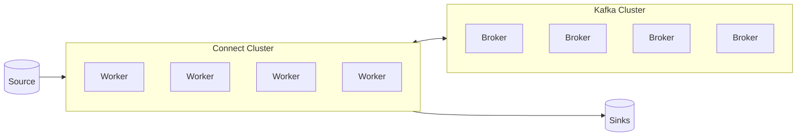

# Kafka Connect

Helps you simplify and improve getting data in and out of kafka

## Kafka Connect Use cases

- Always want to connect data from common sources......Databases, MongoDB, SQL...............Blockchain etc
- Always want to store data in the same sinks...S3, ElasticSearch,SAP, MongoDB etc
- Tough to achieve Fault Tolerance, Exactly Once, Distribution Order
----> Use stuff written by other programmers

## Kafka Connect and Streams Architecture Design

TODO make properly

# Kafka Connect - High Level
- Source Connectors to get data from Common Data Sources
- Sink Connectors to publish that data in Common Data Stores
- Make it easy for *non-experienced devs* to quickly get their data reliably into Kafka
- Part of an ETL pipeline
- Scaling is easy
- Code is reusable

## Kafka Connect - Concepts
- Kafka Connect Cluster has multiple loaded Connectors
- -- Each connector is a re-usable piece of code (java jars)
- -- There are many open source connectors available....would be wise to use them
- Connectors + User Configurations => Tasks
- -- A task is linked to a connector configuration
- -- A job configuration may spawn multiple tasks
- Tasks are executed by Kafka Connect Workers (servers)
- -- A worker is a single java process
- -- A worker can be standalone or in a cluster

## Kafka Connect Workers Standalone vs Distributed Mode
- Standalone:
- -- A single process runs your connectors and tasks
- -- Configuration is bundled with your process
- -- Very easy to get started with, useful for development and testing
- -- Not fault-tolerant, no scalability, hard to monitor
- Distributed:
- -- Multiple workers run your connectors and tasks
- -- Configuration is submitted using a REST API
- -- Easy to scale and fault-tolerant (re-balancing in case a worker dies)
- -- Useful for production deployment of connectors.

## Kafka Connect Cluster Distributed Architecture in Details
INSERT DIAGRAM HERE