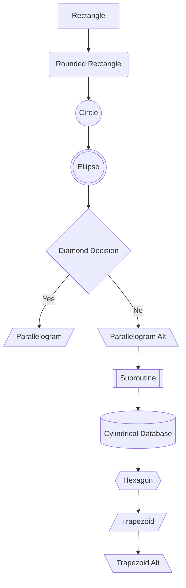
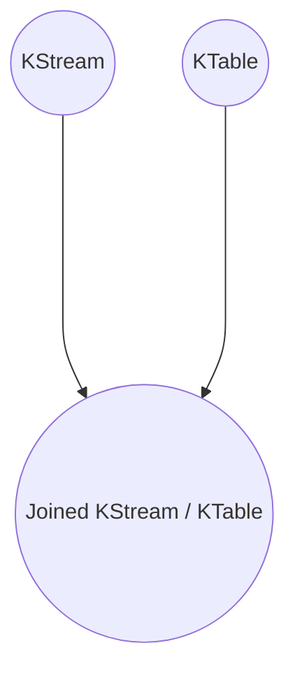
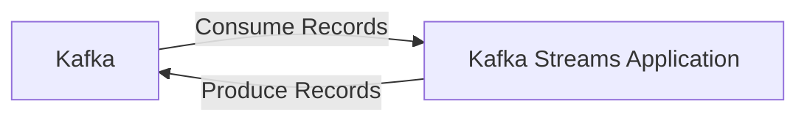
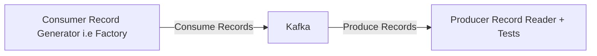

# Kafka Streams

- Kafka streams is an easy data processing and transformation library within Kafka
- Ships with the Kafka binary, i.e its within Kafka projects so it is not an external library created by a third part.
- Can create kafka streams applications of any kind

### Use cases

- Could be to transform data, it could be to enrich data, perform fraud detection or monitoring and alerting.

# Concept

- Kafka streams is a library that you set on top of Kafka and that you would create your application on top of.

### What is kafka streams

- It's just a standard java library, and it can be launched like any Java application.
- No need to create a separate cluster
- Highly scalable, elastic and fault-tolerant
- Has exactly once capabilities
- -- First library in the world that has streaming *exactly once* capabilities with kafka. **very important**
- Processes one record at a time, **so there is no batching**.
- This is true streaming some other libraries like spark streaming process things in batches, and it works for any
  application size.



# Kafka Streams Architecture Design

TODO make properly

```mermaid
graph LR
    A[(Source)] --> B[\n\n\n\nConnect\nCluster\nWorkers\n\n\n\n\n]
B --> C[123]

subgraph C[Kafka Cluster]
S1[Broker] <--> SA1[Streams App 1]
S2[Broker] <--> SA2[Streams App 2]
S3[Broker] <--> SA3[Streams App 3]
S4[Broker] <--> SA4[Streams App 4]
end
C --> B
B --> D[(Sinks)]

```

---

## Kafka Streams Application Terminology

TODO - add diagram

- A stream: is a sequence of immutable data records, that fully ordered, can be replayed and is fault-tolerant (Think of
  a Kafka Topic as a parallel) ???
- A stream processor: is a node in the processor topology (graph). It transforms incoming streams, record by record and
  may create a new stream from it.
- A topology: is a graph of processors chained together by streams.

TODO - add diagram

- Source processor - is a special processor that takes its data directly from a Kafka Topic. It has no predecessors in a
  topology and doesn't transform the data.
- Sink processor - is a processor that does not have children, it sends the stream data directly to a Kafka topic.

## Kafka Streams Application - Writing a topology

- Leverage the High Level DSL
    - Simple
    - Has most operations for most transformation tasks
    - Contains a lot of syntax helpers
    - Its descriptive
- There is also a Low Level Processor API
    - It is imperative API
    - Can be used to implement the most complex logic, but isn't always needed

---

## KStreams and KTables Simple Operations

### KStreams

- All inserts
- Similar to a log
- Infinite
- Unbounded data streams

### KTables

- All upserts on non null values
- Deletes on null values
- Similar to a table
- Parallel with log compacted topics

### When to use KStream vs KTable?

- KStream reading from a topic that is not compacted
- KTable reading from a topic that is log-compacted (aggregations)
- KStream if new data is partial information / transactional
- KTable - more if you need a structure that is like a "database table" where every update is self-sufficient.

## KStream and KTable - Stateless vs Stateful Operations

- Stateless means that the result of a transformation only depends on the data-point you process
    - Example: "multiply by 2". Operation is stateless because it doesn't need memory of the past to be achieved
- Stateful means that the result of a transformation also depends on an external information - the state
    - Example: a count operation is stateful because your app needs to know what happened since it started running in
      order to know the computation result.

## KStream and KTable MapValue / Map

- Take one record an produces one record
- MapValues
    - Only affects values
    - Does not change keys
    - Does not trigger a repartition
    - For KStreams and KTables
- Map
    - Affects both keys and values
    - Triggers a re-partition
    - For KStreams only

## KStreams and KTables Advanced Operations (Stateful)

- Takes one record and produces zero or one record
- Filter
    - does not change keys / values
    - Does not trigger a repartition
    - For KStreams and KTables
- FilterNot
    - Inverse of Filter

## KStream and KTable - FlatMapValues / FlatMap

- Takes one record and produces zero, one or more records
- FlatMapValues
    - does not change keys
    - does not trigger a repartition
    - For KStreams only
- FlatMap
    - Changes keys
    - triggers a repartitions
    - For KStreams only

## KStream Branch

- Branch (split) a KStream based on one or more predicates
- Predicates are evaluated in order, if no matches, records are
- You get multiple KStreams as a result

## KStream SelectKey

- Assigns a new Key to the record (from old key and value)
- marks the data for re-partitioning
- Best practice is to isolate that transformation to know exactly where the partitioning happens

## Reading from Kafka

- You can read a topic as a KStream, a KTable or a GlobalKTable

## KStream and KTable Writing to Kafka

- You can write any KStream or KTable back to Kafka
- If you write a KTable back to Kafka, think about creating a log compacted topic
- Terminal operation - write the records to a topic
- Through - Write to a topic and get a stream / table from the topic

## Streams marked for re-partition

- *As soon as an operation can possibly change the key*, the stream will be marked for repartition
    - Map
    - FlatMap
    - SelectKey
- So only use these APIs if you need to change the key, otherwise use their counterparts:
    - MapValues
    - FlatMapValues
- Repartitioning is done seamlessly behind the scenes but will incur a performance cost (read and write to Kafka)

## Refresher on Log Compaction

- Log Compaction can be a huge improvement in performance when dealing with KTables because eventually records get
  discarded
- This means less reads to get to the final state (less time to recover)
- Log Compaction has to be enabled by you on the topics that get created (source or sink topics)

### Log Cleanup Policy: Compact

- Log compaction ensures that your log contains at least the last known value for a specific key within a partition.
- Very useful if we just require a SNAPSHOT instead of full history (such as for a data table in a database)
- The idea is that we only keep the latest "update" for a key in out log

### Log compaction Guarantees

- Any consumer that is reading from the head of a log will still see all the messages sent to the topic
- Ordering of messages is kept, log compaction only removes some messages, but does not re-order them.
- The offset of a message is immutable (it never changes). Offsets are just skipped if a message is missing
- Deleted records can still be seen by consumers for a period of `delete.retention.ms` (default is 24 hours)

### Log Compaction Myth Busting

- It doesn't prevent you from pushing duplicate data to Kafka
    - De-duplication is done after a segment is committed
    - Your consumers will still read from head as soon as the data arrives
- It doesn't prevent you from reading duplicate data from kafka
    - Same points as above
- Log Compaction can fail from time to time
    - It is an optimisation and the compaction thread might crash
    - Make sure you assign enough memory to it and that it gets triggered

### KStream and KTable Duality (*from confluent docs*)

- Stream as Table: A stream can be considered a change log, where each data record in the stream captures a state change
  of the table.
- Table as Stream: A table can be considered a snapshot, at a point in time, of the latest value for each key in a
  stream (a stream's data records are key-value pairs)

### Transforming a KTable to a KStream

- It is sometimes helpful to transform a KTable to a KSTream in order to keep a changelog of all the changes to the
  KTable
    - Can be achieved in one line of code (TODO add code snippet)
- Two ways:
    - Chain a groupByKey() and an aggregation step (count, aggregate, reduce)
    - Write back to Kafka and read as a KTable

## Exactly Once Semantics

### What is exactly once?

- Exactly once is the ability to guarantee that data processing on each message will happen only once, and that pushing
  the message back to Kafka will also happen effectively only once (Kafka will de-dup)
- Guaranteed when both input and output system is Kafka, **not for Kafka to any external systems**
- You can only get Exactly Once Semantics if you Kafka brokers are of version >= 0.11 and your Kafka Streams Client is
  of version >= 0.11

````mermaid

sequenceDiagram
    participant Kafka
    participant KafkaStreams as Kafka Streams Producer and Consumer
    Kafka ->> KafkaStreams: 1) Receive Message
    KafkaStreams ->> Kafka: 2) Send Output
    Kafka ->> KafkaStreams: 3) Receive Ack
    rect rgb(255, 20, 20)
        Note right of KafkaStreams: ⚠️ Problem: A reboot after step 3, will lead to the message being received twice.\
    end
    KafkaStreams ->> Kafka: 4) Commit Offset

````

- As a Kafka Consumer (at least once):
    - You receive twice the same message if the Kafka broker reboots or your Kafka Consumer restarts
    - This is because the offsets are committed once in a while, but the data may have been processed already.

---

````mermaid

sequenceDiagram
    participant Kafka
    participant KafkaStreams as Kafka Streams Producer and Consumer
    Kafka ->> KafkaStreams: 1) Receive Message
    KafkaStreams ->> Kafka: 2) Send Output
    rect rgb(255, 20, 20)
        Note right of KafkaStreams: ⚠️ Problem: A network failure after step 2, will lead to the message being sent twice.
    end
    Kafka ->> KafkaStreams: 3) Receive Ack
    KafkaStreams ->> Kafka: 4) Commit Offset


````

- As a Kafka Producer:
    - You send twice the same message to Kafka if you don't receive an `ack` back from Kafka (because of the retry
      logic)
    - But not receiving an ack does not mean Kafka hasn't received your message. It may mean that the network just
      failed instead of Kafka.

### Exactly Once in Kafka 0.11 (*TODO check the latest*)

- Complex engineering details:
    - The producers are now idempotent (if the same message is sent twice or more due to retries, Kafka will make sure
      to only keep one copy of it).
    - You can write multiple messages to different Kafka topics as part of one transaction (either all are written, or
      non are written). This is a !new! *advanced* API. (Check Kafka latest)
- *To achieve this they had to change some logic and the internal message format in Kafka 0.11, therefore only this
  broker and client version can achieve it.*
- You will only have to use libraries that implement the new API. Like Kafka Streams.

### What's the problem with "At Least Once Semantics anyway?"

- Cases when it's *not acceptable* to have at least once:
    - Getting the exact count by key for a stream.
    - Summing up bank transactions to compute a person's bank balance
    - Any operation that is not idempotent
    - Any financial computation
- Cases when it's acceptable to have at least once:
    - Operations on time windows (because the time itself can be vague)
    - Approximate operations (counting the number of times an IP hits a webpage to detect attacks and webscraping)
    - Idempotent operations (such as max, min, etc.....)

### How to do exactly once in Kafka Streams

- One additional line of code, the rest is the same!

```java

Properties props = new Properties();
...
        props.

put(StreamsConfig.PROCESSING_GUARANTEE_CONFIG, StreamsConfig.EXACTLY_ONCE);
...
KafkaStreams streams = new KafkaStreams(builder, props);

```

- Currently(........), Kafka Stream is the only library that has implemented this feature, but it is possible that
  Spark, Flink and other frameworks implement it in the future too.
- What's the trade-off?
    - Results are published in transactions, which might incur a small latency.
    - This can be fine tuned using the setting `commit.interval.ms`

## Joins - KStream to GlobalKTable

### Joins KStreams and KTables

- Joining means taking a KStream and / or KTable and creating a new KStream or KTable from it



### Joins KStreams and KTables

- There are 4 kinds of joins (SQL-like), and the most common one will be analysed in a further section, including
  behaviour and usage.
- See http://docs.confluent.io/3.2.2/streams/developer-guide-html#joining for more info.

| Join Operands           | Type         | (INNER) JOIN  | LEFT JOIN     | OUTER JOIN    |
|-------------------------|--------------|---------------|---------------|---------------|
| KSteam-to-KStream       | Windowed     | Supported     | Supported     | Supported     |
| KTable-to-KTable        | Non-Windowed | Supported     | Supported     | Supported     |
| KStream-to-KTable       | Non-Windowed | Supported     | Supported     | Not Supported |
| KStream-to-GlobalKTable | Non-Windowed | Supported     | Supported     | Not Supported |
| KTable-to-GlobalKTable  | N/A          | Not Supported | Not Supported | Not Supported |

### Joins Constraints - Co-partitioning of data

- These 3 joins:
    - KStream / KStream
    - KTable / KTable
    - KStream / KTable
- ...Can only happen when the data is co-partitioned. Otherwise the join won't be doable and Kafka Stream will fail with
  a Runtime Error
- That means that the same number of partitions is there on the stream and / or the table.
- To co-partition data, if the number of partitions is different, write back the topics through Kafka before the join.
  *This has a network cost*

### Joins GlobalKTable

- If your KTable data is reasonably small, and can fit on each of your Kafka Streams applications, you can read it as a
  GlobalKTable
- With GlobalKTables, you can join any stream to your table even it the data doesn't have the same number of partitions.
- That's because the table data lives on every Streams application instance
- The downside is size on disk, but that's okay for reasonably sized data set.

### Understand the different types of joins via *set theory / relational algebra* - Inner Joins

- Join the data only if it has matches in both *streams* of data.

The inner join of two relations \( A \) and \( B \) on the key attribute is defined as:

$$
A \bowtie B = \{ (a, b) \mid a \in A, \ b \in B, \ \text{and} \ a.\text{key} = b.\text{key} \}
$$

### Understand the different types of joins via *set theory / relational algebra* - Left Joins

- Join all the data from the left whether or not it has a match on the right

The left join of two relations \( A \) and \( B \) on the key attribute is defined as:

$$
A \ \text{LEFT JOIN} \ B = \{ (a, b) \mid a \in A, \ b \in B, \ a.\text{key} = b.\text{key} \} \ \cup \ \{ (a, \text{null}) \mid a \in A, \ \not\exists b \in B : a.\text{key} = b.\text{key} \}
$$

Equivalently, using relational algebra:

$$
A \ \text{LEFT JOIN}_{A.\text{key} = B.\text{key}} \ B = (A \bowtie B) \cup \left( A - \pi_{A}(A \bowtie B) \right) \times \{ \text{null}_B \}
$$

### Understand the different types of joins via *set theory / relational algebra* - Outer Joins

- Only available for KStream / KStream joins
- It's a left join combined with a right join
- From the API doc, it looks like this:

| Join Operands | Type     | (INNER) JOIN                                         |
|---------------|----------|------------------------------------------------------|
| `<K1:A>`      |          | `K1:ValueJoiner(A,null)>`                            |
| `<K2:B>`      | `<K2:b>` | `K2:ValueJoiner(null,b)>`<br/>`K2:ValueJoiner(B,b)>` |
|               | `<K3:c>` | `K3:ValueJoiner(null,C)>`                            |

Algebraically - Outer join

$A \,\text{⟗}\, B = \{ (a, b) \mid a \in A, b \in B, \text{cond}(a, b) \} \cup \{ (a, \text{nulls}_B) \mid a \in A, \nexists b \in B \text{ such that } \text{cond}(a, b) \} \cup \{ (\text{nulls}_A, b) \mid b \in B, \nexists a \in A \text{ such that } \text{cond}(a, b) \}$

Blog post for understanding this in a streaming context (https://www.confluent.io/blog/crossing-streams-joins-apache-kafka/)

---

# Testing Kafka Streams applications

- As part of Kafka Streams 1.1, there is not the possibitlty to test the Topology object of your Kafka Streams applications
- This does not require to run Kafka in your tests and makes it super simple and efficient to ensure your Streams applications are working the way you want them to.

- When running a Kafka Stream Application:


- When Testing a Kafka Stream application
