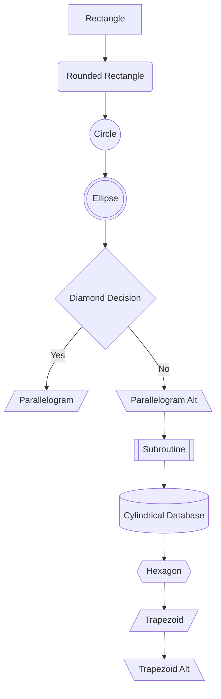
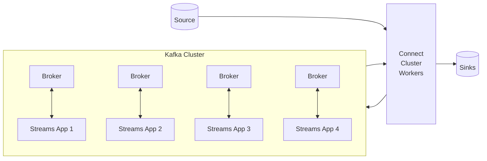

# Kafka Streams

- Kafka streams is an easy data processing and transformation library within Kafka
- Ships with the Kafka binary, i.e its within Kafka projects so its not an external library created by a third part.
- Can create kafka streams applications of any kind

### Use cases

- Caould be to transform data, it could be to enrich data, perform fraud detection or monitoring and alerting XD

# Concept

- Kafka streams is a library that you set on top of Kafka and that you would create your application on top of.

### What is kafka streams

- It's just a standard java library, and it can be launched like any Java application.
- No need to create a separate cluster
- Highly scalable, elastic and fault-tolerant
- Has exactly once capabilities
- -- First library in the world that has streaming exactly once capabilities with kafka.....very important
- Processes one record at a time, so there is no batching.
- This is true streaming some other libraries like spark streaming process things in batches, and it works for any
  application size.

# Kafka Streams Architecture Design
TODO make properly

