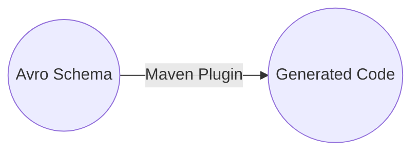
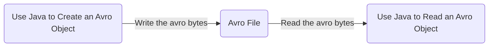
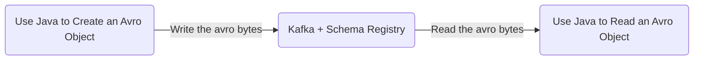
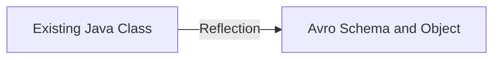
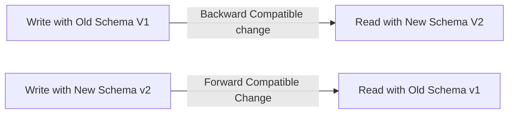

# Confluent Schema Registry and REST Proxy

### Use case

Kafka producers just send bytes. No data verification is performed. These bytes are just consumed.

Things to consider:
- What if the data is bad?
- What if a field changes?
- What if a data format changes?

The consumers will break.
If this happens then all real time capability will break down.
**This can lead to real issues for companies.**

We need data to be self describable.
We need to be able to evolve data without breaking downstream consumers

### Solution
Use schemas and a schema registry

### Why this way?
We can't verify the messages that the kafka brokers receive because it would break the strengths / strong points of kafka
- Kafka doesn't parse or even read your data (no CPU usage)
- Kafka takes bytes as an input without even loading them into memory (*zero copy*)
- Kafka distributes bytes
- As far as kafka is concerned, it doesn't even know if your data is an integer, string etc.

### The need for a schema registry
- The Schema Registry has to be a separate component
- Producers and Consumers need to be able to talk to it
- The Scheme Registry must be able to reject bad data
- A common data format must be agreed upon
  - It needs to support schemas
  - It needs to support evolution
  - It needs to be lightweight
  - The Solution here is the Confluent Schema Registry and Apache Avro as the data format

### Kafka Ecosystem Kafka Core


### Kafka Ecosystem: Confluent Scheme Registry
TODO fix layout


### Kafka Ecosystem: Confluent REST Proxy


---

# What is Avro?

## An Evolution of data 

### Comma Separated Values (CSV)

- Advantages
  - Easy to parse
  - Easy to read
  - Easy to make sense of
- Disadvantages
  - The data types of elements has to be inferred and is not a guarantee
  - Parsing becomes tricky when data contains commas
  - Column names may or may not be there

### Relational tables definitions

- Relational table definitions add types
```sql 
  CREATE TABLE .......
```
- Advantages
  - Data is fully typed
  - Data fits in a table
- Disadvantages
  - Data has to be flat
  - Data is stored in a database and data will be different for each database

### JSON (JavaScript Object Notation)
- JSON format can be shared across the network
```json
{
  "cake_id": "diabetes",
  "price": "very expensive"
}
```
- Advantages
  - Data can take any form (array, nested elements)
  - JSON is a widely accepted format on the web
  - JSON can be read by pretty much any language
  - JSON can be easily shared over a network
- Disadvantages
  - Data has no schema enforcing
  - JSON Objects can be quite big in size because of repeated keys

### AVRO
- Avro is defined by a schema (schema is written in JSON)
- To get started, you can view Avro as JSON with a schema attached to it

Advantages:
- Data is fully typed
- Data is compressed automatically (less CPU usage)
- Schema (defined using JSON) comes along with the data
- Documentation is embedded in the schema
- Documentation is embedded in the schema
- Data can be read across any language
- Schema can evolve over time, in a safe manner (schema evolution)

Disadvantages:
- Avro support for some languages may be lacking (but the main ones is fine)
- Can't "print" the data without using the avro tools (because it's compressed and serialised)


### Avro vs Protobuf vs Thrift vs Parquet vs ORC vs ...
- Overall, all of these data formats achieve pretty much the same goal
- At Kafka's level, what we care about is one message being self explicit and fully described as we're dealing with streaming (so no ORC Parquet etc)
- Avro has good support from Hadoop based technologies like Hive
- Avro has been chosen as the only supported data format from Confluent Schema Registry so "we will go along with that?????"
- There is no need to compare performance etc unless you can prove that Avro is indeed a performance roadblock in your programs (**That won't happen unless you reach insane volumes of 1 million messages per second**)

---

# Avro Primitive Types
- Primitive Types are the support base types
  - null: no value
  - boolean : a binary value
  - int: 32-bit signed integer
  - long: 64-bit signed integer
  - float: single precision (32-bit) IEEE 754 floating point number
  - double: double precision (64-bit) IEEE 754 floating point number
  - string: unicode character sequence

---

# Avro Record Schema Definition
- Avro Record Schemas are defined using JSON
- It has some common fields:
  - Name: Name of your schema
  - Namespace: (equivalent of package in java)
  - Doc: Documentation to explain your schema
  - Aliases: Optional other names for your schema
  - Fields
    - Name: Name of your field
    - Doc: Documentation for that field
    - Type: Data type for that field (can be a primitive type)
    - Default: Default Value for that field

[//]: # (TODO consider doing the excercise for throughness)

---

# Avro Complex Types
- Enums - These are for fields you know for sure tha their values can be enumerated
  - Note: Once an enum is set, changing the enum values is forbidden if you want to maintain compatibility
- Array - are a way for you to represent a list of undefined size of items that all share the same schema
- Maps - are a way to define a list of keys and values where the keys are strings.
- Unions - can allow a field value to take different types
  - If defaults are defined, the default must be of the type of the first item inu the union. (in this case "string").
- The most common use case for unions is to define an optional value.
  - Note: for the default don't write "null", write `null`

---
# Logical Types
- Avro has a concept of logical types used to give more meaning to already existing primitive types.
- The most commonly used are:
  - decimals (bytes)
  - date (int)
  - time-millis (long) - number of milliseconds after midnight
  - timestamp-millis (long) - the number of milliseconds from the unix epoch, 1 January 1970 00:00:00.000 UTC

### How to use a logical type?
- To use a logical type, just add "logicalType":"time-millis" to the field name, and it will help avro schema processors to infer a specific type.
  - Note: logical types are new (1.7.7), not fully supported by all languages and don't play nicely with unions. *Caution when using them*

---
# The complex case of Decimals - Floats, Doubles and Decimals

- Floats and Doubles are floating binary point types. They represent a number like this: 10001.10010110011
- Decimal is a floating decimal point type. They represent a number like 12345.65789
  - **Some decimal cannot be represented accurately as floats or doubles** -- *one for a certain type of math person*
  - People use floats and doubles for scientific computations (imprecise computations) because these types are fast.
  - People use decimals for money. That's why it was created in the first place.
    - Use decimal when you need "exactly accurate" results.

## The complex case of Decimals In Avro
- Avro introduces a decimal logical type, but its underlying type is "bytes". That means that if you print an avro as json, you won't see the decimal value, just some gibberish.
- Additionally, transforming these bytes ina decimal is very error-prone if the language you're using didn't implement that feature.
  - Example: "The official Avro library for Java didn't get it right the first time (AVRO-1869)"

### How to deal with decimals in Avro?
- Advise against using Decimals as a logical type for now. If you're using other languages (not Java). Wait until the toolset matures and all libraries have solid support for it. (Solid advice lol)
- In the meantime, here are the alternatives:
  - Use "string" to represent the decimal value. It will look good when printing the data and is easy to parse and understand.
  - Create your own "Decimal" type with the following:
    - Integer part (long)
    - Decimal part (long)

---

# Avro useful resources

- [Avro Documentation](http://avro.apache.org/docs/current/spec.html)
- [Oracle Avro Getting Started](https://docs.oracle.com/cd/E57769_01/html/GettingStartedGuide/avroschemas.html)
- [Avro Schemas used By Rabo Bank]( https://github.com/Axual/rabo-alerts-blog-post/tree/master/src/main/avro)
- [Avro examples by Gwen Shapira]( https://github.com/gwenshap/kafka-examples)

---

### Summary / Todo List

- [ ] Item Here
- [x] Item Here
- [ ] Item Here
- [ ] Item Here

---

# Avro In Java

### Generic Record
- A GenericRecord is used to create an avro object from a schema, the schema being referenced as:
  - A file
  - A string
- It's not the most recommended way of creating Avro objects because things can fail at runtime, but it is the simplest way.

### Specific Record
- A SpecificRecord is also an Avro Object, but it is obtained using code generation from an Avro Schema
- There are different plugins for different build tools (gradle, maven, sbt) etc but here the official code generation tool will be used. Avro with Maven



- Same task as with a generic record but all using a SpecficRecord.

---
### Overview **without** schema registry


---

### Overview with Schema Registry


---

### Using the Avro Tools

- It is possible to read avro files using the avro tools commands
- These are very handy when we want to display (print) data to a command line for a quick analysis of the content of an Avro file

---

### Avro Reflection
- You can use Reflection in order to build Avro Schemas from your class
- This is a less common scenario but still a valid one. It is useful when you want to add some classes to your Avro Objects



---
## Schema Evolution - Business Problem
- Avro enables us to evolve our schema over time, to adapt with the changes from the business
  - Example: Today we're asking for the First Name and Last Name of out customer and that's out v1 Avro Schema but tomorrow we may ask for their phone number. That would be v2 of our schema.
- We want to be able to make the schema evolve without breaking programs reading out stream of data.

## Schema Evolution - High Level
- There are 4 kinds of schema evolution
  1) Backward - A backward compatible change is when a new schema can be used to read old data.
  2) Forward - A forward compatible change is when an old schema can be used to read new data
  3) Full - Which is both backward and forward
  4) Breaking - Which is non of those

## Schema Evolution - Backward compatible
- Backward - A backward compatible change is when a new schema can be used to read old data
TODO insert and example here
- We can read old data with the new schema, thanks to a default value. In case the field doesn't exist, Avro will use the default.
- We want backwards when we want to successfully perform queries (HIVE-SQL for example) over old and new data using a new schema.

## Schema Evolution - Forward Compatible
- Forward - a forward compatible change is when an old schema can be used to read new data
- TODO insert example JSON
- We can read new data with the old schema, Avro will just ignore new fields. *Deleting fields without defaults is not forward compatible*
- We want forward compatible when we want to make a data stream evolve without changing our downstream consumers.

## Schema Evolution - Fully Compatible
- Full - which is both backward and forward
- TODO insert JSON
- Only add fields with defaults
- Only remove fields that have defaults
- When writing your schema changes, most of the time you want to target full compatibility.

## Schema Evolution - Not compatible
- Examples of changes that are **not** compatible.
  - Adding / Removing elements from an Enum
  - Changing the type of a field (string => int for example)
  - Renaming a required field (field without default)

### Advice when writing an Avro Schema
1) Make your primary key required.
2) Give default values to all the fields that could be removed in the future.
3) Be very careful when using Enums as they can't evolve over time.
4) Don't rename fields. You can add aliases instead (other names).
5) When evolving a schema, ALWAYS give default values.
6) When evolving a schema, NEVER delete a required field.

## Schema Evolution Diagram



## Summary
- Three methods to create and Avro Schema
  - Generic Record
  - Specific Record (recommended way)
  - Reflection
- Types of Schema Evolution
  - Backward
  - Forward
  - Full
- Rules for writing a good Avro Schema

---
# Summary on compatibility changes 💡
- Two patterns
- Write a forward compatible change (very common)
  - Update your producer to V2, the consumers won't break
  - can take your time updating consumers to V2
- Write a backward compatible change (less common)
  - Update all consumers to V2, you will still be able to read v1 producer data
  - When all are updated, update the producer to V2

