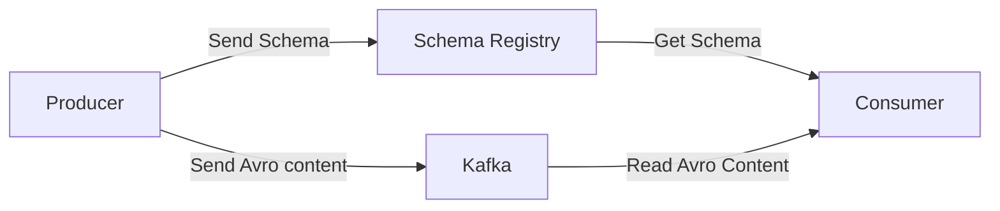
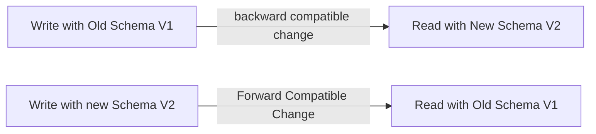

# Confluent Schema Registry Purpose

---

- Store and retrieve schemas for Producers / Consumers
- Enforce Backward / Forward / Full compatibility on topics
- Decrease the size of the payload of data sent to Kafka

---
# Confluent Schema Registry Operations

- We can add schemas
- We can retrieve a schema
- We can update a schema
- We can delete a schema (as of 3.3.0)
- All of this through a REST API
- Schemas can be applied to key and / or values.

---

# Avro Console Producer and Consumer
- The Avro Console Producer allows us to quickly send data to Kafka manually by specifying the schema as an argument.
- The binaries come with the Confluent Distribution of Kafka (accessible through Docker or accessible through the Confluent Binaries)

---

# Reminder / Important: Schema Evolution
